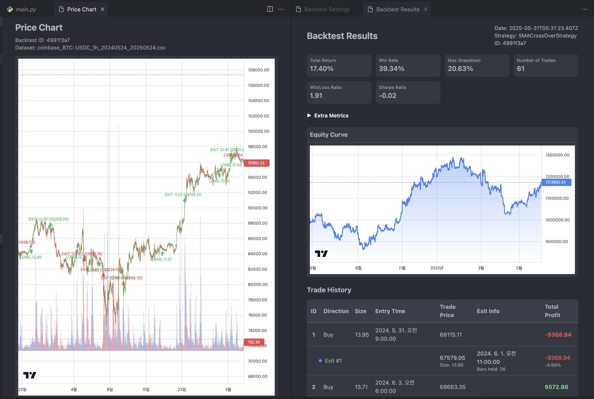

# Backtest Manager

<div align="center">
    

Backtest Manager is your go-to tool for algorithmic trading strategy development—a powerful VSCode extension that makes backtesting simple and efficient. No more juggling complex configurations or switching between multiple tools!


</div>

## ✅ Why Use Backtest Manager?

Developing trading strategies can be complex and time-consuming. With Backtest Manager, you can:
- **Save hours of setup** – everything runs directly in your preferred backtest engine and IDE.
- **Visualize results instantly** – see your strategy's performance without extra tools.
- **Iterate quickly** – tweak parameters and re-run tests in seconds.
- **Focus on strategy logic** – avoid technical setup and configuration hassles.
- **Make better trading decisions** – rely on solid data and performance metrics.
- **Leverage AI assistance** – use Copilot, Cursor, Roo, Cline, or any AI coding agent to help with your trading strategies.

## 🌟 Key Features

- **Strategy & Backtest Management**: Build, organize, and keep your backtest projects tidy in VSCode.
- **Quick Parameter Tweaks**: Change settings and rerun tests easily.


- **Visual Analysis**: Instantly view results with clear charts and stats.


- **Dataset Download**: Easily fetch datasets from any exchange and timeframe.


## 🚀 Currently Supported Engines

- [Backtrader](https://www.backtrader.com/)
- [VectorBT](https://vectorbt.dev/)
- Any Python-based Backtest Engines (choose your favorite)

## 🔮 Planned Support for Future Engines
- [Nautilus Trader](https://nautilustrader.io/)
- [LEAN Engine (QuantConnect)](https://www.quantconnect.com/)
- Language support beyond Python

## 🚦 Getting Started

### 📋 Installation Requirements

- Visual Studio Code 1.98.0 or higher
- Python 3.8+
- [Python Extension](https://marketplace.visualstudio.com/items?itemName=ms-python.python) 
- Backtest libraries (Choose)

```bash
# backtrader
pip install backtrader

# vectorBT
pip install vectorbt
```

### 💻 Extension Installation

1. Search for and install the [Backtest Manager](https://marketplace.visualstudio.com/) extension in the VSCode marketplace.
2. Restart VSCode (recommended).

## 📚 How to Use

### ✍️ Writing Strategies

Backtest Manager provides a basic template, and you can write your own strategies, even let AI write instead of you! Let your trading ideas flow!

<details>
<summary>Backtrader Example</summary>

```python
import backtrader as bt
import os


class SMACrossOverStrategy(bt.Strategy):
    params = (
        ('fastPeriod', int(os.environ['fast'])),
        ('slowPeriod', int(os.environ['slow'])),
        ('stopLoss', 2),
        ('takeProfit', 5)
    )
    
    def __init__(self):
        self.fast_ma = bt.indicators.SimpleMovingAverage(
            self.data.close, 
            period=self.params.fastPeriod
        )
        self.slow_ma = bt.indicators.SimpleMovingAverage(
            self.data.close, 
            period=self.params.slowPeriod
        )
        
        self.crossover = bt.indicators.CrossOver(self.fast_ma, self.slow_ma)
        
        self.entry_price = None
        self.stop_loss = None
        self.take_profit = None
        
    def next(self):
        if not self.position:
            if self.crossover > 0:
                close = self.data.close[0]
                self.buy()
                self.entry_price = close
                
                self.stop_loss = close * (1 - self.params.stopLoss / 100)
                self.take_profit = close * (1 + self.params.takeProfit / 100)
        else:
            close = self.data.close[0]
        
            if close <= self.stop_loss or close >= self.take_profit:
                self.close()
                self.entry_price = None
                self.stop_loss = None
                self.take_profit = None
                return
            
            if self.crossover < 0:
                self.close()
                self.entry_price = None
                self.stop_loss = None
                self.take_profit = None

def cerebro_init(cerebro: bt.Cerebro):
    cerebro.addsizer(bt.sizers.PercentSizer, percents=95)

# No driver code (e.g. cerebro.run()) needed
# Backtrader Documentation: https://www.backtrader.com/docu/quickstart/quickstart/
```
Each project must include a `cerebro_init` function. This lets the extension handle data loading and configuration automatically before running your backtest.

</details>

<details>
<summary>VectorBT Example</summary>

```python
import vectorbt as vbt


# Build portfolio args 
def portfolio_init(close) -> dict:
    portfolio_kwargs = {}
    
    fast_ma = vbt.MA.run(close, 10)
    slow_ma = vbt.MA.run(close, 50)

    portfolio_kwargs['close'] = close
    portfolio_kwargs['entries'] = fast_ma.ma_crossed_above(slow_ma)
    portfolio_kwargs['exits'] = fast_ma.ma_crossed_below(slow_ma)
    
    return portfolio_kwargs

# No driver code (e.g. vbt.Portfolio.from_signals()) needed
# VectorBT Documentation: https://vectorbt.dev/
```
Each project must include a `portfolio_init` function. The extension uses this to load data, set parameters, and run your backtest automatically.

</details>

<details>
<summary>Custom Engine Example</summary>

```python
# Write backtesting code with your custom engine here.
# Don't forget to print your backtest results so that Backtest Manager can capture them.

print("t: {
    'ref': 0, 
    'datetime': "2024-05-30T14:00:00+00:00", 
    'price': 10202.0, 
    'size': 2, 
    'value': 20404.0, 
    'commission': 20.4, 
    'side': 'long'
}")

print("t: {
    'ref': 0,
    'datetime': "2024-05-31T00:00:00+00:00",
    'price': 10302,
    'size': 2,
    'pnl': 200.0,
    'pnlcomm': 179.6,
    'commission': 20.4,
    'hold_bars': 10
}")

print("e: { 
    'datetime': "2024-05-30T14:00:00+00:00", 
    'value': 3000000 
}")

```
Each project must include a `portfolio_init` function. The extension uses this to load data, set parameters, and run your backtest automatically.

</details>

### 🆕 Create a New Project
Start a new backtest project in just a few clicks and types.


### 📥 Download Dataset
Easily download historical data for your backtests with just a few clicks.

 

### ⚙️ Setting Parameter and Running a Backtest
Ready, Set, Go!


### 📊 Result Analysis
Analyze your strategy's performance with comprehensive analytics:
- Equity curve graph – visualize your profits
- Performance metrics (total return, Sharpe ratio, max drawdown, win rate, etc.)
- Trade history (time, price, size, profit, etc.)


### 🐞 Debugging Strategy
You can enable verbose output for your backtest scripts and choose whether to automatically delete completed backtest scripts in the extension settings.  


## 📜 License

Distributed under the MIT License.

## 🤝 Contributing

Have ideas to make this even better? Issues and pull requests are always welcome! Please check the issue tracker before contributing.

